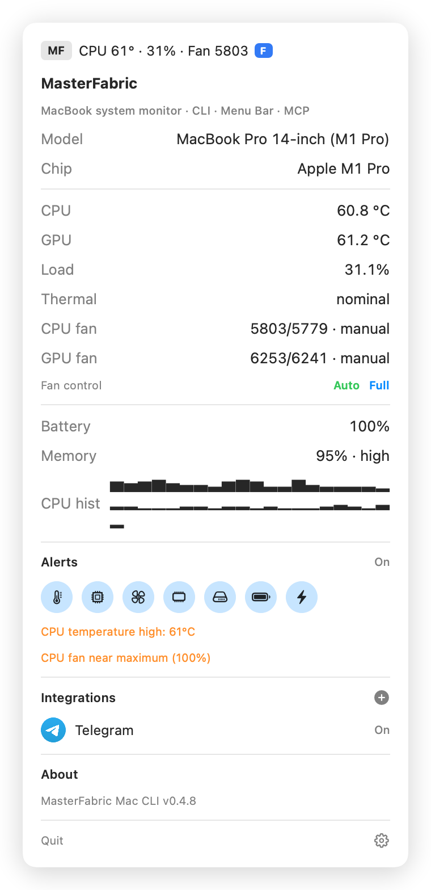
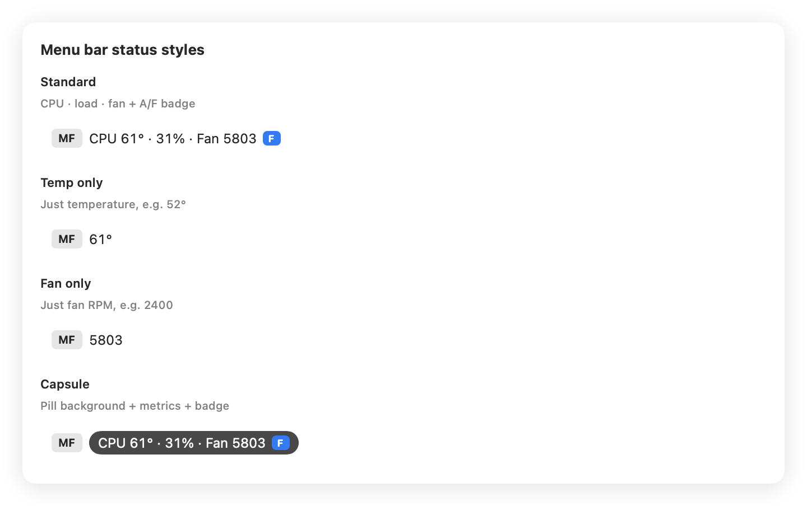
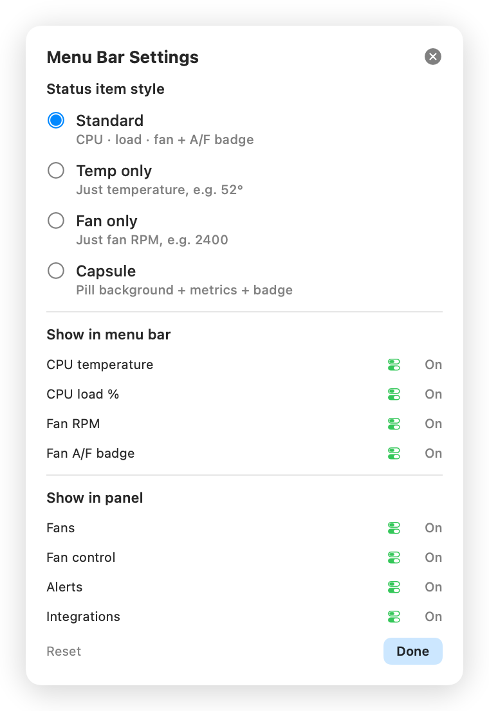
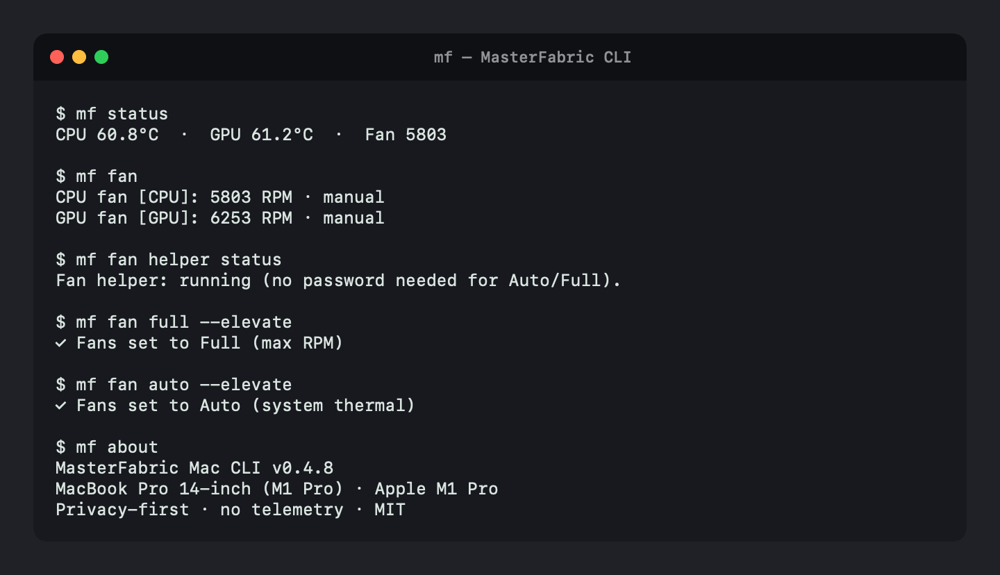

# MasterFabric Mac CLI

<p align="center">
  
</p>

> **Experimental open-source software.** Not affiliated with Slack, Telegram, Apple, or any third-party service. Sensors and configs stay on your Mac. **By using this tool you accept responsibility** for how you run it, what credentials you store, and any effects on your machine or connected accounts.

> MacBook system monitor with a first-class **MCP** server — so Cursor, Claude, and any agent can read CPU/GPU temps, fans, battery, and more on your machine.

[](LICENSE)
[](https://github.com/gurkanfikretgunak/masterfabric-mac-cli)
[](https://github.com/gurkanfikretgunak/masterfabric-mac-cli#mcp--agent-ready)
[](Package.swift)
[](README.md)

**Repo:** [github.com/gurkanfikretgunak/masterfabric-mac-cli](https://github.com/gurkanfikretgunak/masterfabric-mac-cli)

Native Swift · Apple Silicon first · **No telemetry** · MIT

---

## Why MasterFabric?

| Surface | What you get |
|--------|----------------|
| **MCP** | AI agents call `get_status`, `get_battery`, `get_cpu_load`, … over stdio |
| **CLI (`mf`)** | Scriptable metrics with `--json` |
| **Menu Bar** | Always-on status strip (4 styles) · fan Auto/Full · settings gear · alerts |

Built for developers who want local hardware context inside their coding agents — not another closed menu-bar utility.

---

## MCP — agent-ready

MasterFabric speaks **Model Context Protocol** out of the box. Point Cursor or Claude Desktop at one binary:

```bash
mf mcp
```

**Cursor** — add to `~/.cursor/mcp.json`:

```json
{
  "mcpServers": {
    "masterfabric": {
      "command": "/Users/YOU/.local/bin/mf",
      "args": ["mcp"]
    }
  }
}
```

Copy-paste starter: [examples/mcp.json](examples/mcp.json)

### Tools agents can call

| Tool | Returns |
|------|---------|
| `get_status` | CPU/GPU °C + fan RPM |
| `get_temp` / `get_fan` | Temps or fans (CPU + GPU roles) |
| `set_fan_mode` | `auto` or `full` (max RPM) for both fans |
| `get_info` | Model, chip, macOS, RAM, uptime |
| `get_battery` | %, health, cycles, watts |
| `get_memory` / `get_disk` / `get_network` | Host metrics |
| `get_cpu_load` | Overall + per-core % |
| `get_power` | Thermal state, Low Power Mode |
| `get_top` / `get_history` | Hot processes + 1h sparklines |
| `set_alert_threshold` | Update `config.toml` alerts |
| `check_version` | Local vs GitHub open-source version |
| `run_update` | Upgrade from GitHub install script (JSON) |
| `get_about` | Version + privacy |

**Resource:** `masterfabric://status` — live JSON snapshot.

> Your sensors never leave the Mac. MCP is **local stdio** only — no cloud relay.

---

## Install (CLI)

**One-liner:**

```bash
curl -fsSL https://raw.githubusercontent.com/gurkanfikretgunak/masterfabric-mac-cli/main/scripts/install.sh | bash
```

**From source:**

```bash
git clone https://github.com/gurkanfikretgunak/masterfabric-mac-cli.git
cd masterfabric-mac-cli
make install
export PATH="$HOME/.local/bin:$PATH"
```

**Verify:**

```bash
mf --version
mf status
mf menubar
```

Requires macOS 13+ and Swift (Xcode or CLT). Apple Silicon recommended.

Homebrew formula (tap after tagging a release): [`Formula/masterfabric.rb`](Formula/masterfabric.rb)

---

## Menu Bar

Live status item with configurable styles (CPU °C · load · fan, temp-only, fan-only, or capsule pill). Click for metrics, **Fan Auto/Full**, **Alerts**, **Integrations**, and **Settings** (gear next to Quit).



### Display settings & styles

Open the panel → gear next to **Quit**. Choose a status style and toggle what appears in the strip and dropdown.

| Style | Look |
|-------|------|
| **Standard** | CPU · load · fan + green **A** / blue **F** badge |
| **Temp only** | Just degrees, e.g. `52°` |
| **Fan only** | Just RPM |
| **Capsule** | Dark pill background + metrics + badge |





```bash
mf menubar          # launch
mf login enable     # start at login
```

App bundle: `~/.local/MasterFabricMenuBar.app` (no Dock icon).

- **Fan control** — **Auto** / **Full** for CPU + GPU fans (one-time admin helper install)
- **Settings** — gear next to Quit; saved under `[menubar]` in `config.toml`
- **Alerts** — tap thermometer / GPU / fan / memory / disk / battery / power icons to edit thresholds; optional **Send to Integrations**
- **Integrations** — Slack · Telegram · Mail with on/off toggles, Edit, and circle brand badges (configure without the terminal via **+**)

---

## CLI

Scriptable metrics with `--json`. Example session (status, fan helper, Auto/Full):



```bash
mf status
mf cpu
mf memory
mf notify status
mf bot --help
mf about
```

### Cheat sheet

```text
mf status | temp | fan | fan auto | fan full | info
```

Fan control (`mf fan auto` / `mf fan full`) writes SMC keys and usually needs elevation:

```text
# Recommended (menu bar / one-time admin helper):
mf fan helper install          # password once
mf fan full --elevate
mf fan auto --elevate

# Or classic sudo each time:
sudo mf fan full
sudo mf fan auto
```

Menu Bar **Auto** / **Full** installs a root helper the first time (one password), then switches without prompting again.

```text
mf battery | memory | disk | network | cpu
mf power | top | history | watch
mf check [--notify]
mf notify status | test | send --channel slack "hello"
mf bot telegram
mf version [--check] [--json]
mf update [--force] [--json]
mf config show | init | set <key> <value>
mf login enable | disable | status
mf about [--lang en|tr]
mf menubar
mf mcp
```

All read commands support `--json`.

---

## Integrations — Slack · Telegram · Mail

Optional notification channels you configure yourself. MasterFabric is **not** an official product of these services.

<p align="center">
  
  &nbsp;&nbsp;&nbsp;
  
  &nbsp;&nbsp;&nbsp;
  
</p>

<p align="center">
  <strong>Slack</strong>
  &nbsp;&nbsp;&nbsp;&nbsp;&nbsp;&nbsp;&nbsp;&nbsp;&nbsp;&nbsp;
  <strong>Telegram</strong>
  &nbsp;&nbsp;&nbsp;&nbsp;&nbsp;&nbsp;&nbsp;&nbsp;
  <strong>Mail</strong>
</p>

| | Channel | What you provide |
|---|---------|------------------|
|  | **Slack** | Incoming webhook URL |
|  | **Telegram** | Bot token + numeric chat id |
|  | **Mail** | `resend` / `mailgun` API key, or `smtp` |

Push alerts (or any message) to chat/email from the CLI, menu bar, or MCP. Tokens stay in `~/.config/masterfabric/config.toml` — never commit them.

```bash
mf config init
mf config set integrations.slack.enabled true
mf config set integrations.slack.webhook_url "https://hooks.slack.com/services/…"

mf config set integrations.telegram.enabled true
mf config set integrations.telegram.bot_token "123:ABC"
mf config set integrations.telegram.chat_id "987654321"

mf config set integrations.mail.enabled true
mf config set integrations.mail.provider resend   # or smtp | mailgun
mf config set integrations.mail.from "alerts@example.com"
mf config set integrations.mail.to "you@example.com"
mf config set integrations.mail.api_key "re_xxx"

mf notify test --channel all
mf check --notify
mf notify send --channel slack "CPU spike on build machine"
```

Full sample: [examples/integrations.toml](examples/integrations.toml)

MCP tools: `notify_send`, `notify_status`.

### Telegram interactive bot (Q&A)

Keep a process running on the Mac so the bot can answer questions with live metrics:

```bash
mf bot telegram
```

Then in Telegram:

```text
/status
/temp
/fan
/battery
how's the fan?
cpu load?
```

Only the configured numeric `chat_id` is allowed. Ctrl+C stops the listener.

---

## Version

Single source of truth: root [`VERSION`](VERSION) (synced into `AppVersion.current` on build).

```bash
mf version              # local
mf version --check      # compare to GitHub releases/tags (open-source repo)
mf version --check --json
mf update               # install newer release from GitHub (scripts/install.sh)
mf update --force       # reinstall even if already current
mf update --json        # machine-readable result
```

Exit code `2` means an update is available. Install/update from source:

```bash
curl -fsSL https://raw.githubusercontent.com/gurkanfikretgunak/masterfabric-mac-cli/main/scripts/install.sh | bash
```

Bump a release: edit `VERSION`, run `make version-sync`, commit, tag `vX.Y.Z`.

---

`~/.config/masterfabric/config.toml` — language, poll interval, alert thresholds, launch-at-login.

```bash
mf config init
mf config set alerts.cpu_temp_celsius 88
```

**Privacy-first:** readings stay on-device. No analytics, no accounts, no network calls for core monitoring.

---

## Open source

- **License:** [MIT](LICENSE)
- **Issues / PRs:** welcome at [gurkanfikretgunak/masterfabric-mac-cli](https://github.com/gurkanfikretgunak/masterfabric-mac-cli)
- **Stack:** SwiftPM · IOKit/SMC · SwiftUI `MenuBarExtra` · MCP JSON-RPC stdio

```bash
swift build
swift run mf status
make install
```

---

## License

MIT © MasterFabric contributors
